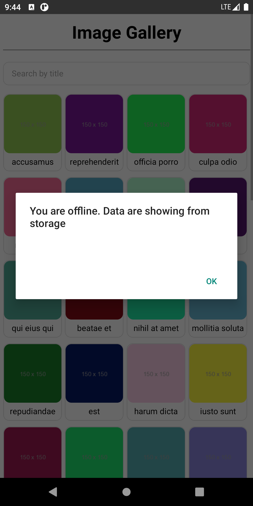

This is a new [**React Native**](https://reactnative.dev) project, bootstrapped using [`@react-native-community/cli`](https://github.com/react-native-community/cli).

# Getting Started

> **Note**: Make sure you have completed the [React Native - Environment Setup](https://reactnative.dev/docs/environment-setup) instructions till "Creating a new application" step, before proceeding.

## Step 1: Clone Code

First, you will need to clone code from this repository

```bash
# using git
git clone https://github.com/nurislammridha/image-gallery-app.git

```

## Step 2: Import all dependencies

Second, you will need to install all dependencies

```bash
cd image-gallery-app
# using npm
npm install

# OR using Yarn
yarn install
```

## Step 3: Start your Application

For starting application you will run bellow command (in project directory image-gallery-app)

### For Android

```bash
# using npm
npx react-native run-android

```

### For iOS

```bash
# using npm
npx react-native run-ios

```

If everything is set up _correctly_, you should see your new app running in your _Android Emulator_ or _iOS Simulator_ shortly provided you have set up your emulator/simulator correctly.

This is one way to run your app — you can also run it directly from within Android Studio and Xcode respectively.

# Output Features:

### 01) Loader:

After open App, Gallery page load with api data, a loader are showing when api call.


### 02) Responsive design gallery page:

    Gallery page is full responsive. Different wide of device and after rotation (widely) page are not break.

  
  


### 03) Search:

    A real time search are added. After search data are filtered.


### 04) Offline Mode:

    An alert are shown when device is offline and data are showing which were stored in storage.




### 05) Details Page:

    After click one image block, details screen is appeared with corresponding data, here design are also responsive.


### 06) Back Button:

    A back button is available bottom of details page which is functional.


# Builded App Link:


